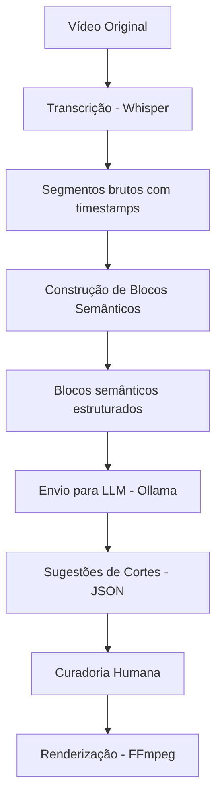
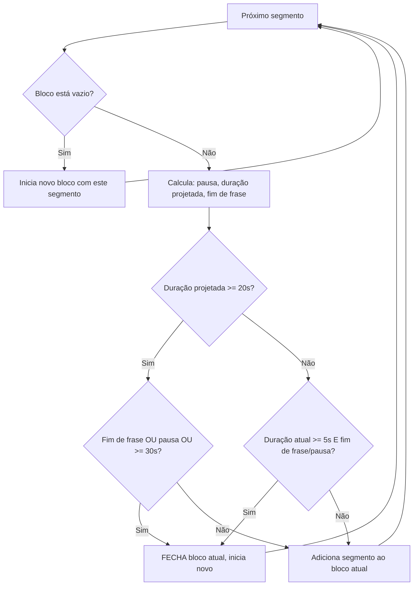
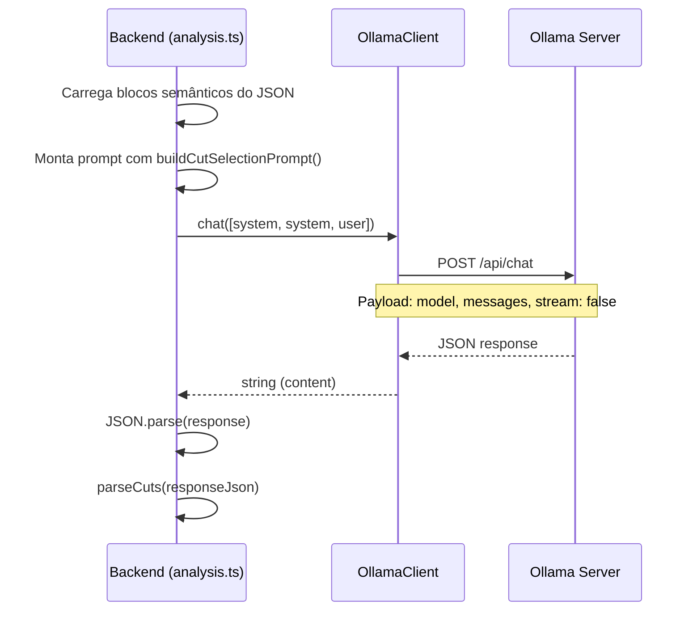
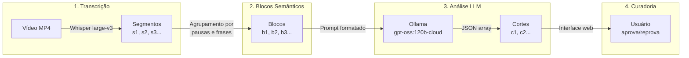

# Pipeline de Análise Semântica e Geração de Cortes

Documentação técnica detalhando o fluxo completo desde a transcrição do vídeo até a geração de sugestões de cortes para Shorts.

---

## Visão Geral do Pipeline

O sistema opera como um pipeline sequencial de 4 etapas principais:

```
Vídeo → Transcrição (Whisper) → Blocos Semânticos → Análise com LLM → Cortes Sugeridos
```



O código do pipeline está em `backend/src/pipeline/` e cada etapa é um módulo isolado. A orquestração é feita pelo `orchestrator.ts`.

---

## Etapa 1: Transcrição com Whisper

**Arquivo:** `backend/src/pipeline/transcription.ts`

### O que faz

O Whisper (modelo `large-v3` por padrão) recebe o vídeo como entrada e gera uma transcrição segmentada. Cada segmento é um trecho de fala com timestamps.

### Como funciona

1. O arquivo de vídeo é localizado no diretório do job
2. O Whisper é executado como um processo externo via `child_process.spawn`
3. O comando é construído dinamicamente com base nas configurações ativas (modelo, device, idioma, etc.)
4. O Whisper gera um JSON com segmentos de transcrição
5. O sistema parseia o JSON e normaliza os dados em objetos `Segment`

### Modelo de dados: `Segment`

```typescript
// backend/src/models/segment.ts
interface Segment {
  segment_id: string;  // Ex: "s1", "s2", "s3"
  start: number;       // Tempo de início em segundos (ex: 0.0)
  end: number;         // Tempo de fim em segundos (ex: 4.32)
  text: string;        // Texto transcrito do segmento
}
```

### Exemplo de saída

```json
[
  { "segment_id": "s1", "start": 0.0, "end": 3.52, "text": "Então galera, hoje eu vou falar sobre" },
  { "segment_id": "s2", "start": 3.52, "end": 7.18, "text": "como funciona o algoritmo do YouTube." },
  { "segment_id": "s3", "start": 7.18, "end": 12.44, "text": "E o primeiro ponto é que ninguém realmente sabe." },
  { "segment_id": "s4", "start": 13.10, "end": 18.22, "text": "Mas existem padrões que a gente pode observar." }
]
```

> O Whisper gera segmentos curtos (tipicamente 2-10 segundos cada). Esses segmentos **não têm contexto semântico** — são apenas trechos de fala agrupados por pausa. É por isso que existe a etapa seguinte.

---

## Etapa 2: Construção de Blocos Semânticos

**Arquivo:** `backend/src/pipeline/semantic_blocks.ts`

### Objetivo

Agrupar os segmentos brutos do Whisper em **unidades de sentido completas** — blocos que representam uma ideia inteira, não apenas um trecho de frase. Isso é fundamental porque:

- Segmentos do Whisper frequentemente cortam frases no meio
- O LLM precisa receber contexto coerente, não fragmentos desconexos
- Os cortes finais precisam começar e terminar em fronteiras naturais de fala

### Constantes de Configuração

```typescript
const TARGET_MIN_SECONDS = 5.0;       // Duração mínima alvo de um bloco
const TARGET_MAX_SECONDS = 20.0;      // Duração máxima alvo de um bloco
const HARD_MAX_SECONDS = 30.0;        // Limite rígido absoluto
const PAUSE_THRESHOLD_SECONDS = 0.6;  // Pausa mínima para ser considerada fronteira
const SENTENCE_BOUNDARIES = [".", "!", "?", "…"];  // Delimitadores de fim de frase
```

### Algoritmo de Agrupamento

O algoritmo itera sobre todos os segmentos de forma sequencial, acumulando segmentos em um bloco corrente até encontrar uma condição de fechamento.



#### Lógica detalhada (passo a passo)

Para cada segmento, o sistema calcula:

1. **`pause`** — intervalo de tempo entre o fim do segmento anterior e o início do segmento atual
2. **`currentDuration`** — duração acumulada do bloco até o último segmento adicionado
3. **`projectedDuration`** — duração que o bloco teria se o segmento atual fosse incluído
4. **`endSentence`** — se o texto do segmento anterior termina com `.`, `!`, `?` ou `…`
5. **`isPause`** — se o intervalo entre segmentos é ≥ 0.6 segundos

A decisão de fechar o bloco segue estas regras:

| Condição | Fecha o bloco? |
|---|---|
| Duração projetada ≥ 20s **E** (fim de frase **OU** pausa) | ✅ Sim |
| Duração projetada ≥ 30s (hard limit) | ✅ Sim (independentemente) |
| Duração atual ≥ 5s **E** (fim de frase **OU** pausa) | ✅ Sim |
| Nenhuma das condições acima | ❌ Não, continua acumulando |

#### Princípios do algoritmo

- **Nunca quebra frases no meio** — só fecha em fronteiras de sentença ou pausas naturais
- **Respeita pausas naturais** — silêncio ≥ 0.6s indica mudança de pensamento
- **Duração alvo: 5-20 segundos** — blocos granulares o suficiente para combinação flexível
- **Limite rígido: 30 segundos** — forçado para evitar blocos gigantes mesmo sem fronteira clara

### Modelo de dados: `SemanticBlock`

```typescript
// backend/src/models/semantic_block.ts
interface SemanticBlock {
  block_id: string;       // Ex: "b1", "b2", "b3"
  start: number;          // Tempo de início do primeiro segmento
  end: number;            // Tempo de fim do último segmento
  text: string;           // Texto consolidado de todos os segmentos do bloco
  segment_ids: string[];  // IDs dos segmentos originais incluídos
}
```

### Exemplo de transformação

**Entrada (segmentos do Whisper):**
```json
[
  { "segment_id": "s1", "start": 0.0,  "end": 3.52,  "text": "Então galera, hoje eu vou falar sobre" },
  { "segment_id": "s2", "start": 3.52, "end": 7.18,  "text": "como funciona o algoritmo do YouTube." },
  { "segment_id": "s3", "start": 7.18, "end": 12.44, "text": "E o primeiro ponto é que ninguém realmente sabe." },
  { "segment_id": "s4", "start": 13.10, "end": 18.22, "text": "Mas existem padrões que a gente pode observar." }
]
```

**Saída (blocos semânticos):**
```json
[
  {
    "block_id": "b1",
    "start": 0.0,
    "end": 7.18,
    "text": "Então galera, hoje eu vou falar sobre como funciona o algoritmo do YouTube.",
    "segment_ids": ["s1", "s2"]
  },
  {
    "block_id": "b2",
    "start": 7.18,
    "end": 18.22,
    "text": "E o primeiro ponto é que ninguém realmente sabe. Mas existem padrões que a gente pode observar.",
    "segment_ids": ["s3", "s4"]
  }
]
```

> Note que `s1` e `s2` foram agrupados porque `s1` não termina com pontuação final, e a duração acumulada (7.18s) atinge o mínimo de 5s somente quando `s2` (que termina com `.`) é incluído. Já `s3` inicia um novo bloco porque houve fim de frase em `s2`.

---

## Etapa 3: Envio dos Blocos para a LLM

**Arquivos:**
- `backend/src/pipeline/analysis.ts` — orquestração do envio
- `backend/src/llm/client.ts` — cliente HTTP para o Ollama
- `backend/src/llm/prompts.ts` — templates de prompt

### Montagem do Prompt

A função `buildCutSelectionPrompt()` recebe a lista de blocos semânticos e monta um prompt textual formatado:

```typescript
// backend/src/llm/prompts.ts
function buildCutSelectionPrompt(blocks: SemanticBlock[]): string {
  const blocksText = blocks
    .map(block =>
      `- ${block.block_id} [${block.start.toFixed(2)}-${block.end.toFixed(2)}]: ${block.text}`
    )
    .join("\n");

  return `Runtime context for this analysis:\n\nSemantic blocks:\n${blocksText}`;
}
```

**Exemplo de prompt gerado:**

```
Runtime context for this analysis:

Semantic blocks:
- b1 [0.00-7.18]: Então galera, hoje eu vou falar sobre como funciona o algoritmo do YouTube.
- b2 [7.18-18.22]: E o primeiro ponto é que ninguém realmente sabe. Mas existem padrões que a gente pode observar.
- b3 [18.22-35.10]: O algoritmo valoriza watchtime acima de tudo...
...
```

### System Prompt (Instruções para a LLM)

A LLM recebe duas mensagens de sistema antes do prompt do usuário:

1. **System prompt configurável** — vindo das configurações de ferramenta
2. **System prompt fixo** — `"You output JSON only."`

O system prompt principal (`SYSTEM_PROMPT_TEMPLATE` em `prompts.ts`) contém as seguintes instruções:

#### Regras de seleção de cortes

- Os cortes devem formar **mini-histórias completas** (início, meio, fim)
- Cada corte deve ter no mínimo **300 segundos** (5 minutos)
- O LLM deve escanear **TODOS** os blocos e identificar **todos** os cortes possíveis
- Os cortes **não podem se sobrepor** (cada bloco pertence a no máximo um corte)
- Usar apenas **blocos consecutivos** — nunca pular blocos
- Começar no início natural de um tópico, nunca no meio de uma ideia
- Terminar em uma conclusão natural
- Ordenar por score (melhor primeiro)

#### Critérios de HOOK (primeiros 1-3 segundos)

O primeiro bloco de cada corte **obrigatoriamente** deve ser um hook forte:

- **Impacto imediato** — algo que prende atenção instantaneamente
- **Afirmação forte** — opinião clara e direta
- **Quebra de expectativa** — surpresa ou tensão
- **Opinião polêmica** — gera curiosidade

O que **evitar** como hook:
- Introduções genéricas ("Hoje eu vou falar sobre...")
- Trechos que dependem de contexto anterior

### Comunicação com o Ollama



**Configurações de conexão:**

| Parâmetro | Valor padrão |
|---|---|
| Base URL | `http://localhost:11434` |
| Modelo | `gpt-oss:120b-cloud` |
| Timeout | 120 segundos |
| Stream | `false` (resposta completa) |

**Tratamento de falhas:**

- Se o modelo cloud retornar 401/403, o cliente automaticamente tenta encontrar um **modelo local** já baixado como fallback
- Erros de timeout, conexão recusada e 404 geram mensagens amigáveis em português
- Rate limit (429) instrui o usuário a aguardar

---

## Etapa 4: Parsing da Resposta e Geração dos Cortes

**Arquivo:** `backend/src/pipeline/analysis.ts`

### Formato esperado da resposta da LLM

A LLM deve retornar **exclusivamente** um JSON array (sem markdown, sem texto adicional):

```json
[
  {
    "blocks": ["b12", "b13", "b14", "b15", "b16"],
    "start": 42.1,
    "end": 372.4,
    "score": 94,
    "hook_reason": "Abertura com afirmação forte e provocativa sobre o algoritmo",
    "content_reason": "Trecho autocontido com progressão clara do tema de algoritmos"
  },
  {
    "blocks": ["b25", "b26", "b27", "b28"],
    "start": 520.0,
    "end": 845.3,
    "score": 87,
    "hook_reason": "Pergunta retórica impactante que gera curiosidade",
    "content_reason": "Explicação completa sobre monetização com conclusão clara"
  }
]
```

### Parsing e validação (`parseCuts`)

A resposta JSON é parseada e validada com as seguintes checagens:

1. Verifica se é um array JSON
2. Para cada item, verifica se é um objeto válido
3. Extrai os campos obrigatórios: `blocks`, `start`, `end`
4. Extrai título a partir de `title`, `hook_reason` ou `content_reason` (fallback)
5. Gera um `cut_id` sequencial (`c1`, `c2`, etc.)
6. Status inicial é sempre `"pending"` (aguardando curadoria humana)

### Modelo de dados: `Cut`

```typescript
// backend/src/models/cut.ts
interface Cut {
  cut_id: string;      // Ex: "c1", "c2"
  block_ids: string[]; // IDs dos blocos incluídos no corte
  start: number;       // Tempo de início em segundos
  end: number;         // Tempo de fim em segundos
  title?: string;      // Título sugerido (derivado do hook_reason)
  status: string;      // "pending" | "approved" | "rejected"
}
```

### Persistência

Todos os artefatos intermediários são salvos como JSON no diretório do job:

```
data/jobs/{job_id}/
├── transcription.json      ← Segmentos do Whisper
├── semantic_blocks.json    ← Blocos semânticos construídos
└── cuts.json               ← Cortes sugeridos pela LLM
```

---

## Fluxo Completo: De Ponta a Ponta



### Resumo das transformações

| Etapa | Entrada | Saída | Granularidade |
|---|---|---|---|
| Transcrição | Vídeo (áudio) | Segmentos (`Segment[]`) | 2-10s por segmento |
| Blocos Semânticos | Segmentos | Blocos (`SemanticBlock[]`) | 5-30s por bloco |
| Análise LLM | Blocos | Cortes (`Cut[]`) | ≥ 300s por corte |
| Curadoria | Cortes sugeridos | Cortes aprovados | Decisão humana |

---

## Decisões de Arquitetura

### Por que blocos semânticos antes da LLM?

1. **Redução de tokens** — Em vez de enviar a transcrição inteira segmento por segmento (centenas de linhas), os blocos consolidam o texto, reduzindo o volume de dados
2. **Contexto coerente** — Cada bloco é uma unidade de sentido completa, facilitando a análise de qualidade pelo LLM
3. **Timestamps confiáveis** — Os blocos herdam timestamps precisos dos segmentos do Whisper, garantindo cortes alinhados ao áudio real
4. **Extensibilidade** — A etapa de blocos pode futuramente incorporar análise prosódica, ritmo, silêncio e emoção sem impactar as etapas vizinhas

### Por que a LLM não recebe transcrição bruta?

O LLM **nunca** recebe os segmentos brutos do Whisper. Isso é intencional:

- Segmentos podem ter frases cortadas no meio
- Segmentos curtos demais sobrecarregam o contexto do modelo
- A LLM deve trabalhar com unidades de sentido, não com fragmentos de áudio
- A pré-estruturação dos dados garante que qualquer combinação de blocos consecutivos resultará em um corte com início e fim naturais

### Isolamento de responsabilidades

```
semantic_blocks.ts  → Constrói blocos (lógica determinística, sem IA)
prompts.ts          → Define as instruções e formato esperado
client.ts           → Comunicação HTTP com Ollama (agnóstico ao domínio)
analysis.ts         → Orquestra envio e parsing da resposta
```

Cada componente pode ser substituído ou evoluído independentemente:
- Trocar Whisper por outro ASR → alterar apenas `transcription.ts`
- Mudar estratégia de hook → alterar apenas `prompts.ts`
- Trocar Ollama por outra API → alterar apenas `client.ts`
- Mudar regras de agrupamento → alterar apenas `semantic_blocks.ts`
